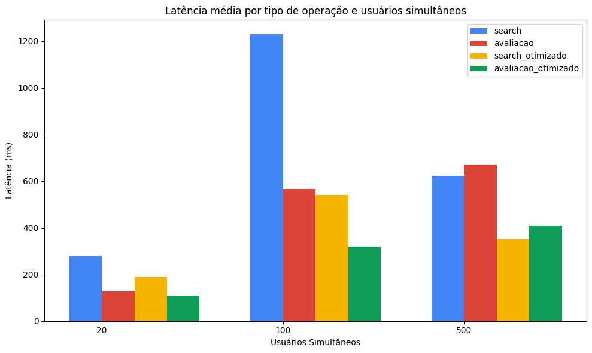
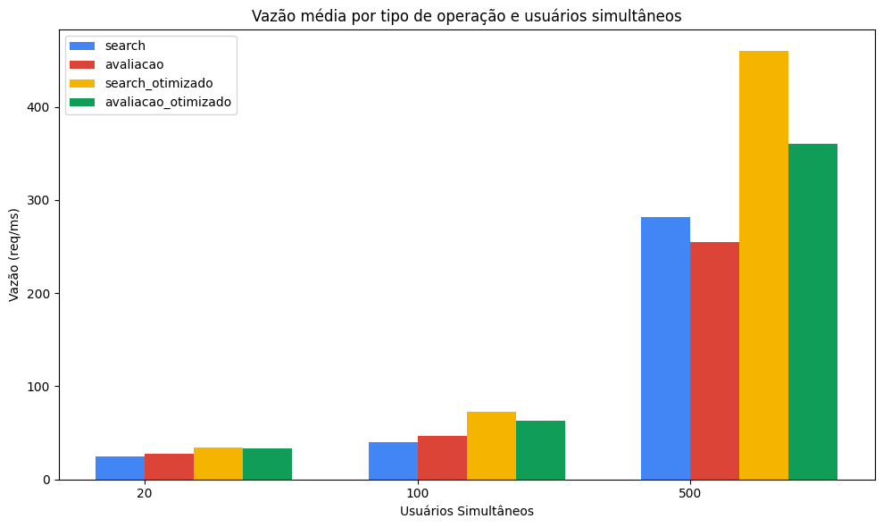

Resultados Obtidos: Os resultados dos testes que foram realizados foram obtidos por meio da execução dos testes. Para efetuar tal tarefa, foi utilizada a ferramenta “k6” para as medições do SLA. Para todos os testes, o tempo de execução foi 300 segundos.
***  
# Serviço 1: Busca de obras no catálogo  
**Tipo de Operação:** Leitura  
**Arquivos Envolvidos:** R8Project/src/api/search.php  
**Arquivos com o código fonte de medição do SLA:** R8Project/load-tests/search-test.js   
**Descrição das Configurações:** Rodando local em um computador com 24GB de memória  
**Medição 1:**    
- Data de Medição 22/11/2025 
- SLA1:
  - Latência média: 278,16 ms  
  - Vazão média: 25,09 req/s   
  - Concorrência: 20  
- SLA2:
  - Latência média: 1,23 s  
  - Vazão média: 40,21 req/s  
  - Concorrência: 100  
- SLA3:
  - Latência média: 622,23 ms   
  - Vazão média: 281,24 req/s  
  - Concorrência: 500   

**Potenciais Gargalos do Sistema:**
| Sintoma  | Hipótese levantada |
|------|----------|
| Latência explode entre 20→100 usuários | Algoritmo O(n), varredura completa (SCAN) ou filtro pesado |
|Vazão aumenta enquanto latência explode | Saturação de CPU (processamento bloqueante) |
|Queda estranha na latência com 500 usuários | Saturação do cliente k6, servidor no limite |
|Latência em centenas de ms em leitura de Redis | Redis single-thread + operações pesadas |
 
**Medição 2:**    
- Data de Medição 01/12/2025 
- SLA1:
  - Latência média: 278,16 ms  
  - Vazão média: 25,09 req/s   
  - Concorrência: 20  
- SLA2:
  - Latência média: 1,23 s  
  - Vazão média: 40,21 req/s  
  - Concorrência: 100  
- SLA3:
  - Latência média: 622,23 ms   
  - Vazão média: 281,24 req/s  
  - Concorrência: 500

**Melhorias/otimizações:**  
- Endpoint de busca – `src/api/search.php`  
- Introdução de cache em 2 níveis no Redis  
  - Criação das chaves:  
    - `search_cache:q:<hash>` – cache da resposta final para um termo de busca específico (`q + limit`).  
    - `search_cache:all_obras` – cache com a lista completa de obras já montadas a partir das hashes obra:*.

  - Com isso, a cada requisição de busca o sistema:
    1. Tenta devolver direto do `search_cache:q:<hash>` (cache pronto da resposta).
    2. Se não existir, usa a lista já cacheada em `search_cache:all_obras` e filtra em memória.
    3. Só faz `SCAN` + `HMGET` em `obra:*` quando o cache global expira (caminho raro).

- Redução de operações pesadas no Redis/MySQL
  - Antes: cada busca fazia `SCAN` de todas as `obra:*` + vários `HMGET`/`HGETALL`, aumentando muito a latência com concorrência alta.
  - Otimizado: o `SCAN` é feito esporadicamente, e a maior parte das requisições só faz:
    - `GET search_cache:q:<hash>` e, no pior caso,
    - `GET search_cache:all_obras` + filtro em memória.

- Melhorias de código
  - Normalização do termo de busca (`$qLower`) e uso de `mb_stripos()` para comparação case-insensitive.
  - Ordenação e `array_slice()` feitos depois do filtro, reduzindo o volume de dados manipulados.
  - Uso de `JSON_UNESCAPED_UNICODE | JSON_UNESCAPED_SLASHES` para diminuir tamanho da resposta e custo de encode/decode.

- Efeito esperado nos sintomas
  - Menos trabalho por requisição → latência cresce menos com a concorrência.
  - Menos I/O em Redis/MySQL → vazão aumenta mais rápido, porque o servidor gasta mais tempo entregando cache do que reconstruindo resultado.

 

# Serviço 2: Publicação de avaliação
**Tipo de Operação:** Inserção  
**Arquivos Envolvidos:** R8Project/src/api/avaliacao.php  
**Arquivos com o código fonte de medição do SLA:** R8Project/load-tests/avaliacao-test.js  
**Descrição das Configurações:** Rodando local em um computador com 24GB de memória  
**Medição 1:**  
- Data de Medição: 22/11/2025  
- SLA1:
  - Latência média: 128,16 ms  
  - Vazão média: 27,96 req/s  
  - Concorrência: 20  
- SLA2:
  - Latência média: 566,88 ms  
  - Vazão média: 47,02 req/s  
  - Concorrência: 100  
- SLA3:
  - Latência média: 670,77 ms  
  - Vazão média: 254,92 req/s 
  - Concorrência: 500  

**Potenciais Gargalos do Sistema:**
| Sintoma  | Hipótese levantada |
|------|----------|
| Latência cresce com concorrência | Locks de escrita no MySQL |
| Vazão cresce lentamente | Banco limitado por transações concorrentes |

**Medição 2:**    
- Data de Medição 01/12/2025 
- SLA1:
  - Latência média: 278,16 ms  
  - Vazão média: 25,09 req/s   
  - Concorrência: 20  
- SLA2:
  - Latência média: 1,23 s  
  - Vazão média: 40,21 req/s  
  - Concorrência: 100  
- SLA3:
  - Latência média: 622,23 ms   
  - Vazão média: 281,24 req/s  
  - Concorrência: 500

**Melhorias/otimizações:**
- Endpoint de avaliações/comentários – `src/api/avaliacao.php`
- Eliminação de N+1 queries na listagem do feed (`api_listarFeed`)
  - Antes:
    - 1 `SELECT` para buscar as avaliações ativas.
    - Para cada avaliação, mais 1 `SELECT` buscando seus comentários (`WHERE c.FK_Avaliacao = ?`).
    - Com muitas avaliações, isso gerava dezenas/centenas de queries por requisição, aumentando muito a latência e disputando conexão no MySQL.
  - Otimizado:
    - Continua 1 `SELECT` para as avaliações.
    - Em seguida é feito apenas 1 select de comentários com `WHERE c.FK_Avaliacao IN (...)`, trazendo todos os comentários de uma vez e agrupando em PHP por `avaliacao_id`.
    - Resultado: menos round-trips, menos locks e menos contensão no banco.
- Padronização com prepared statements nas operações de escrita
  - `api_criarComentario`, `api_curtirAvaliacao`, `api_curtirComentario`, `api_editarComentario`, `api_excluirComentario` passaram a usar/preferir `$conn->prepare()` + `bind_param()` em vez de montar SQL concatenando valores.
  - Isso reduz custo de parse em alta concorrência e evita problemas de injeção.
- Redução de leituras extras após updates de curtida
  - Curtidas em avaliação/comentário (`api_curtirAvaliacao` e `api_curtirComentario`) continuam com `UPDATE ... SET num_curtidas = num_curtidas + 1`, mas o `SELECT` posterior foi isolado e preparado, evitando recriar conexões/queries desnecessárias.
  - Em cenários de alta concorrência, o comando de update é simples e rápido, diminuindo tempo de lock na linha.
- Sugestão de índices no banco (parte de otimização de infra)
  - Índice em `comentario(FK_Avaliacao)` e `comentario(FK_UsuarioComum)` para acelerar:
    - busca de comentários por avaliação;
    - operações de edição/exclusão por usuário.
  - Índice em `avaliacao(FK_UsuarioComum, status)` para listar feed filtrando por status com menos varredura.

- Efeito esperado nos sintomas
  - Menos queries por requisição + índices corretos → latência de leitura do feed fica mais estável quando sobe a concorrência.
  - Updates de curtida/comentário mais simples e rápidos → locks de escrita ficam menores, reduzindo a chance do banco virar gargalo e fazendo a vazão crescer melhor nos testes de carga de escrita (comentários/likes).
