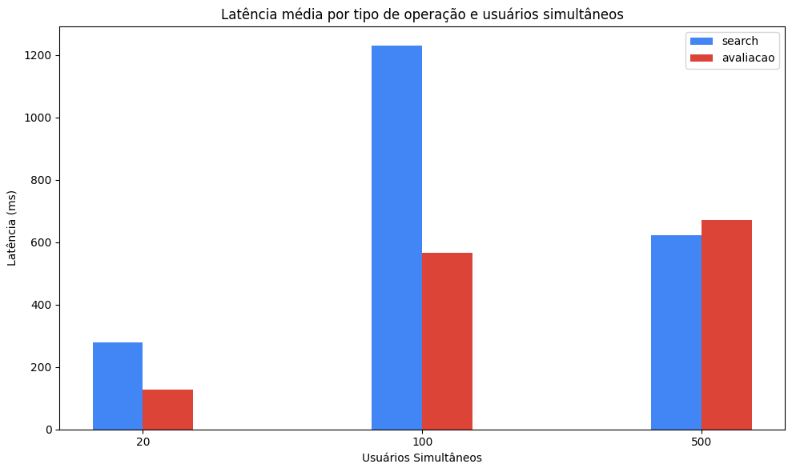
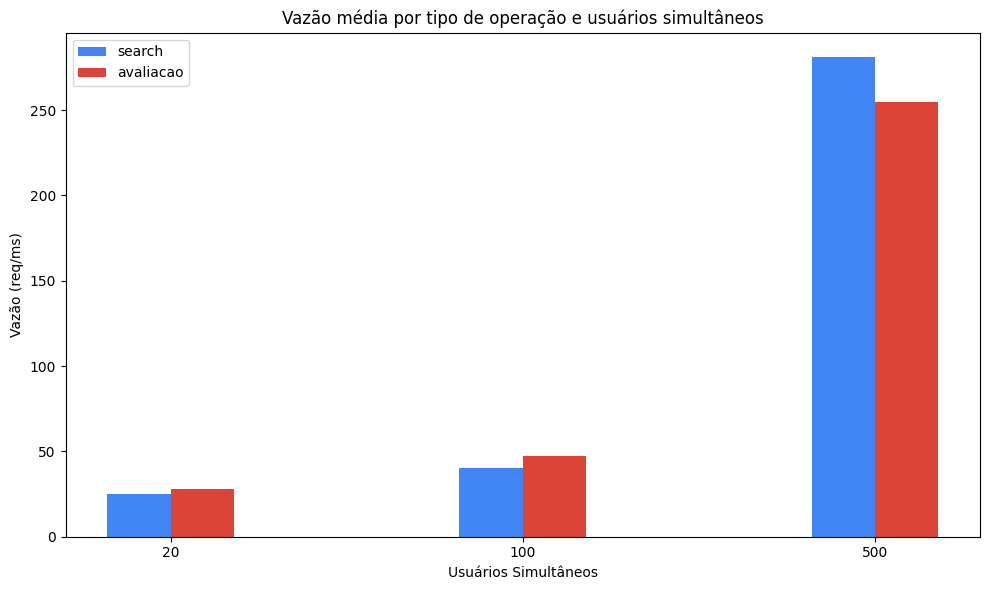

Resultados Obtidos: Os resultados dos testes que foram realizados foram obtidos por meio da execução dos testes. Para efetuar tal tarefa, foi utilizada a ferramenta “k6” para as medições do SLA. Para todos os testes, o tempo de execução foi 300 segundos.
***  
# Serviço 1: Busca de obras no catálogo  
**Tipo de Operação:** Leitura  
**Arquivos Envolvidos:** R8Project/src/api/search.php  
**Arquivos com o código fonte de medição do SLA:** R8Project/load-tests/search-test.js  
**Data de Medição:** 22/11/2025  
**Descrição das Configurações:** Rodando local em um computador com 24GB de memória  
**Resultados dos testes:**    
- SLA1:
  - Latência média: 278,16 ms  
  - Vazão média: 25,09 req/s   
  - Concorrência: 20  
- SLA2:
  - Latência média: 1,23 s  
  - Vazão média: 40,21 req/s  
  - Concorrência: 100  
- SLA3:
  - Latência média: 622,23 ms   
  - Vazão média: 281,24 req/s  
  - Concorrência: 500   

**Potenciais Gargalos do Sistema:**
| Sintoma  | Hipótese levantada |
|------|----------|
| Latência explode entre 20→100 usuários | Algoritmo O(n), varredura completa (SCAN) ou filtro pesado |
|Vazão aumenta enquanto latência explode | Saturação de CPU (processamento bloqueante) |
|Queda estranha na latência com 500 usuários | Saturação do cliente k6, servidor no limite |
|Latência em centenas de ms em leitura de Redis | Redis single-thread + operações pesadas |
 
  
# Serviço 2: Publicação de avaliação
**Tipo de Operação:** Inserção  
**Arquivos Envolvidos:** R8Project/src/api/avaliacao.php  
**Arquivos com o código fonte de medição do SLA:** R8Project/load-tests/avaliacao-test.js  
**Data de Medição:** 22/11/2025  
**Descrição das Configurações:** Rodando local em um computador com 24GB de memória  
**Resultados dos testes:**  
- SLA1:
  - Latência média: 128,16 ms  
  - Vazão média: 27,96 req/s  
  - Concorrência: 20  
- SLA2:
  - Latência média: 566,88 ms  
  - Vazão média: 47,02 req/s  
  - Concorrência: 100  
- SLA3:
  - Latência média: 670,77 ms  
  - Vazão média: 254,92 req/s 
  - Concorrência: 500  

**Potenciais Gargalos do Sistema:**
| Sintoma  | Hipótese levantada |
|------|----------|
| Latência cresce com concorrência | Locks de escrita no MySQL |
| Vazão cresce lentamente | Banco limitado por transações concorrentes |
 
